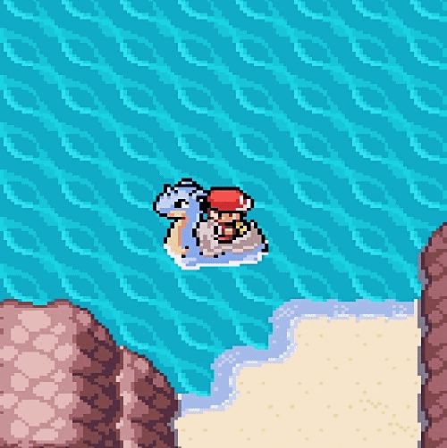
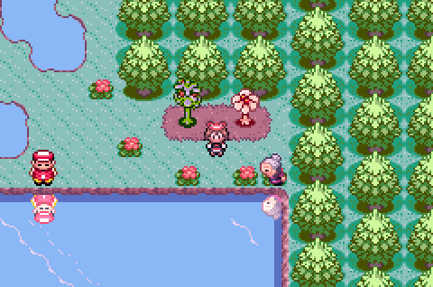

<!-- Banner de apresentação -->
<table align="center" cellspacing="0" cellpadding="0">
  <tr>
    <td>
      
    </td>
    <td>
      
    </td>
  </tr>
</table>

---

 

  
  

 

---

<!-- Tecnologias -->
<h2 align="center">💾 Tecnologias</h2>
 
 

  

 

---

<h2 align="center">🎓 Formação acadêmica</h2>
 

  Cursando <b>Análise e Desenvolvimento de Sistemas</b> pelo <b>CentroWEG</b>
   
  Duração: 2 anos

 

---

<!-- GIF final -->

  

